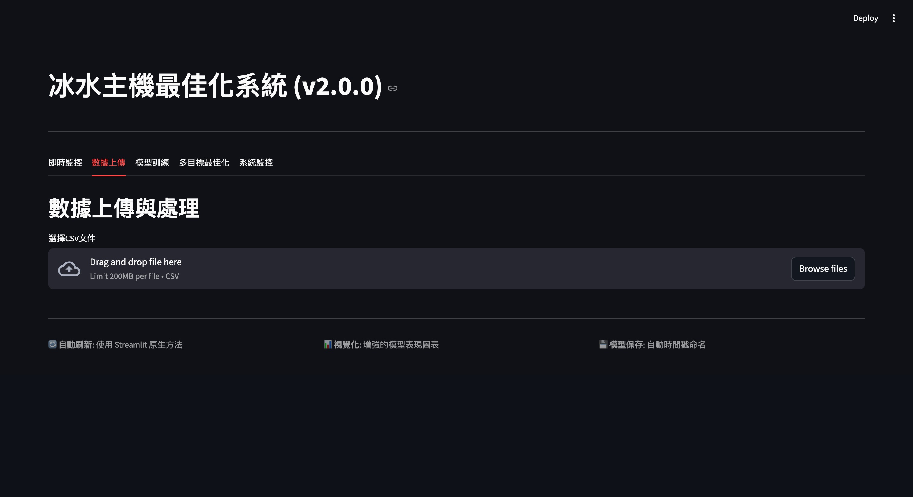

# AI 驅動的冷凍機系統節能優化專案

本專案旨在利用機器學習與最佳化演算法，對工業冷凍機系統進行節能優化，以達成降低總功耗 (Power Consumption) 並提升能源效率 (COP, Coefficient of Performance) 的雙重目標。

## 專案總覽

此系統整合了數據處理、模型訓練、即時監控與參數優化建議，並透過一個互動式的 Web 儀表板呈現。主要功能包含：
- **數據上傳與處理**: 自動化的特徵工程。
- **模型訓練**: 基於 XGBoost 的功耗與 COP 預測模型。
- **參數優化**: 使用 NSGA-II 多目標演算法找出最佳操作參數組合。
- **視覺化儀表板**: 透過 Streamlit 呈現即時數據、優化建議與系統狀態。

---

## 系統架構

本專案採用微服務架構，透過 Docker Compose 進行容器化部署，各元件職責分明：

```mermaid
graph TD
    subgraph User Interface
        A[Streamlit Dashboard]
    end

    subgraph Backend Services
        B[FastAPI Server]
        C[Celery Worker]
        D[Redis]
    end

    subgraph Core Logic
        E[Prediction Models <br>(XGBoost)]
        F[Optimization Algorithm <br>(NSGA-II)]
    end

    A -- API Requests --> B
    B -- Enqueues Tasks --> C
    C -- Executes Tasks --> E
    C -- Executes Tasks --> F
    B -- Stores Task State --> D
    C -- Reads/Writes Task State --> D
    A -- Fetches Task Results --> B
```

- **Streamlit Dashboard**: 前端使用者介面，用於數據視覺化與互動操作。
- **FastAPI Server**: 核心後端，提供 API 接口供前端呼叫。
- **Celery Worker**: 非同步任務執行器，處理耗時的計算任務 (如模型訓練、優化)。
- **Redis**: 訊息佇列 (Message Broker) 與結果後端 (Result Backend)，用於 FastAPI 與 Celery 之間的通訊。
- **Prediction Models**: XGBoost 模型，用於預測在給定操作參數下的功耗與 COP。
- **Optimization Algorithm**: NSGA-II 演算法，用於在多個操作變數的限制下，尋找功耗與 COP 的帕累托最優解 (Pareto Front)。

---

## 模型架構

1.  **預測模型**:
    - **演算法**: 使用 `XGBoost (Extreme Gradient Boosting)`，因其高效、準確且能處理複雜的非線性關係。
    - **目標**: 獨立訓練了兩個模型：
        1.  `cooling_system_total_power_kw`: 預測整個冷凍系統的總功耗 (kW)。
        2.  `cooling_system_cop`: 預測系統的能源效率係數 (COP)。
    - **特徵**: 模型使用了包括環境溫度、濕度、冷卻塔開度、風扇功率、泵浦功率、製程負載等多維度特徵。

2.  **最佳化模型**:
    - **演算法**: `NSGA-II (Non-dominated Sorting Genetic Algorithm II)`，一種強大的多目標最佳化演算法。
    - **優化目標**:
        1.  **最小化** `Power Consumption` (總功耗)。
        2.  **最大化** `COP` (能源效率)。
    - **決策變數**: 演算法會調整以下參數來尋找最佳解：
        - `cooling_tower_opening_pct` (冷卻塔開度)
        - `fan_510a_power_kw` (風扇A功率)
        - `fan_510b_power_kw` (風扇B功率)
        - `fan_510c_power_kw` (風扇C功率)
        - ... 以及其他相關的流量與溫度設定。

---

## API 端點

後端服務提供了以下 RESTful API：

| 方法   | 路徑                               | 說明                                     |
| :----- | :--------------------------------- | :--------------------------------------- |
| `POST` | `/upload-data`                     | 上傳歷史數據 CSV 檔並觸發特徵工程。      |
| `POST` | `/train/power`                     | 觸發功耗預測模型的訓練任務。             |
| `POST` | `/train/cop`                       | 觸發 COP 預測模型的訓練任務。            |
| `POST` | `/optimize`                        | 根據當前系統狀態，執行參數優化任務。     |
| `GET`  | `/logs/{task_id}`                  | 獲取指定任務的狀態與結果。               |
| `GET`  | `/current-system-state`            | 獲取模擬的當前系統即時狀態。             |
| `GET`  | `/health`                          | 檢查 API 服務健康狀態。                  |

---

## 應用程式畫面導覽

以下為 Streamlit 儀表板的主要操作步驟：

**步驟 1: 專案首頁**
應用程式的進入點，提供專案概覽。


**步驟 2: 上傳歷史數據**
使用者可以上傳 CSV 格式的歷史操作數據，系統會進行處理與分析。


**步驟 3: 訓練預測模型**
基於上傳的數據，使用者可以分別觸發功耗 (Power) 和 COP 模型的訓練。


訓練完成後，會顯示模型的評估指標 (如 R2 Score, RMSE)。


**步驟 4: 執行參數優化**
在「Optimization」頁面，系統會顯示當前的操作參數。點擊按鈕後，後端會執行 NSGA-II 演算法，找出兼顧「低功耗」與「高 COP」的多組最佳參數建議。


**步驟 5: 查看優化建議**
優化完成後，儀表板會以表格和散佈圖 (帕累托前緣) 的形式呈現多組建議方案，供操作人員參考。


---

## 安裝與啟動

本專案已完全容器化，強烈建議使用 Docker 進行部署。

**先決條件**:
- [Docker](https://www.docker.com/get-started)
- [Docker Compose](https://docs.docker.com/compose/install/)

**啟動步驟**:

1.  **Clone 專案**:
    ```bash
    git clone https://github.com/markoo0706/refregiration_machine_optimization.git
    cd refregiration_machine_optimization
    ```

2.  **使用 Docker Compose 啟動所有服務**:
    ```bash
    docker-compose up --build
    ```
    此指令會建置映像檔並依序啟動 Redis, API Server, Celery Worker, 和 Streamlit 儀表板。

3.  **存取儀表板**:
    服務啟動後，在您的瀏覽器中開啟以下網址：
    [http://localhost:8501](http://localhost:8501)

4.  **關閉服務**:
    若要停止所有容器，請在終端機中按下 `Ctrl + C`，然後執行：
    ```bash
    docker-compose down
    ```
